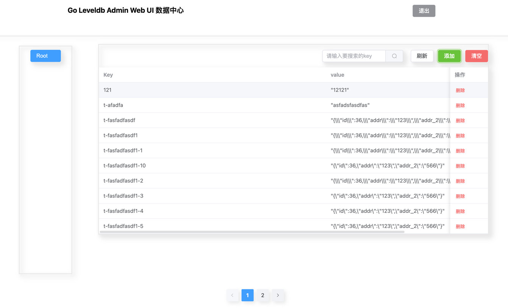

### <p align="center">GoLeveldbAdmin</p>
#### <p align="center">Go Leveldb Admin 可视化Web UI</p>
#### <p align="center"><a href="https://github.com/mazezen/command-fanyi/releases"></a><a href="https://github.com/mazezen/command-fanyi/blob/master/LICENSE"></a><p>

<a href="https://github.com/mazezen/goleveldbadmin" targer="_blank">goleveldbadmin</a>是一款使用golang和vue3+Element-Plus和TypeScript开发的Leveldb的可视化管理平台，它包含了在线的数据库管理和简洁的操作界面，旨在方便用户管理leveldb数据。
支持私有化部署
* <a href="https://goleveldbadmin.mazezen.com/" target="_blank">在线预览</a> 账号: admin 密码: 123456

### 示例页面



### 功能
1. 列表
2. Key关键字搜索
3. 添加
4. 删除
5. 清空leveldb

### 使用说明
* api目录为go后端代码目录
* web-ui 为前端代码目录

### 部署
1. 拉取代码
```shell
git clone git@github.com:mazezen/goleveldbadmin.git
```

2. 拷贝default.yaml文件,改为config.yaml
default.yaml文件内容说明
```yaml
#Source:
#  ServiceName:  # 服务名称 abc
#  Dir:          # leveldb 数据源目录

#Ti:
#  Acc:   # 登录账号
#  Pwd:   # 登录密码
#
#Jwt:
#  ExpireTime:  # 过期时间
#  SECRET: # jwt秘钥
```

3. 打包编译

### docker方式
```shell
docker-compose -f docker-compose.yaml up -d
```
